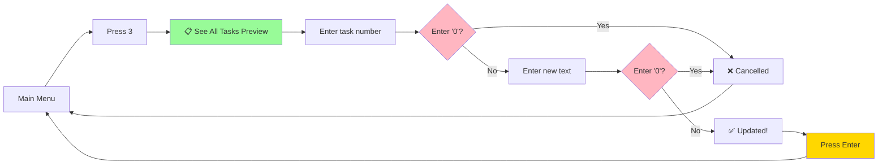

# 🎯 Enhancement Features - Quick Visual Overview

## Feature Summary

```
╔════════════════════════════════════════════════════════════════╗
║                   TO-DO LIST ENHANCEMENTS                      ║
╠════════════════════════════════════════════════════════════════╣
║                                                                ║
║  1. ❌ ESC TO CANCEL                                           ║
║     └─ Press '0' at any prompt to cancel and return to menu   ║
║                                                                ║
║  2. 👁️ TASK PREVIEW                                            ║
║     └─ See task list before Update/Delete/Toggle operations   ║
║                                                                ║
║  3. ⏸️ PRESS ENTER TO CONTINUE                                 ║
║     └─ Pause after operations to read messages                ║
║                                                                ║
╚════════════════════════════════════════════════════════════════╝
```

---

## Before vs After User Experience

### ❌ Feature 1: ESC to Cancel

**BEFORE:**

```
Menu → Select Update → Enter wrong number → Forced to complete
```

**AFTER:**

```
Menu → Select Update → Press '0' → ❌ Cancelled → Back to Menu ✅
```

---

### 👁️ Feature 2: Task Preview

**BEFORE:**

```
Menu → Select Update → "Enter task number: " → ❓ Which task was #3?
```

**AFTER:**

```
Menu → Select Update →
┌──────────────────────┐
│ 1. [ ] Buy milk      │
│ 2. [✓] Call mom      │
│ 3. [ ] Study code    │
└──────────────────────┘
"Enter task number: " → ✅ I can see it's "Study code"!
```

---

### ⏸️ Feature 3: Press Enter to Continue

**BEFORE:**

```
"Task added successfully!"
===== TO-DO LIST APPLICATION =====   ← Menu appears immediately
Status: 1 completed, 2 remaining     ← Can't read success message!
```

**AFTER:**

```
"Task added successfully!"
Press Enter to continue...           ← User reads message
[User presses Enter]                 ← When ready
===== TO-DO LIST APPLICATION =====   ← Then menu appears ✅
```

---

## Implementation Phases

```
Phase 1: ESC CANCEL
┌─────────────────────────────────────┐
│ ✅ Add Task - Already done          │
│ ✅ Update Task - Already done       │
│ ✅ Delete Task - Already done       │
│ ✅ Toggle - Already done            │
│ ⬜ Modify Slots - To be added       │
└─────────────────────────────────────┘

Phase 2: TASK PREVIEW
┌─────────────────────────────────────┐
│ ⬜ Create preview function          │
│ ⬜ Add to Update Task               │
│ ⬜ Add to Delete Task               │
│ ⬜ Add to Toggle Complete           │
└─────────────────────────────────────┘

Phase 3: PRESS ENTER
┌─────────────────────────────────────┐
│ ⬜ Create wait_for_enter function   │
│ ⬜ Add after Add Task               │
│ ⬜ Add after View All               │
│ ⬜ Add after Update Task            │
│ ⬜ Add after Delete Task            │
│ ⬜ Add after Toggle Complete        │
│ ⬜ Add after Save Tasks             │
│ ⬜ Add after Load Tasks             │
│ ⬜ Add after Modify Slots           │
└─────────────────────────────────────┘
```

---

## User Flow Example

### Scenario: User wants to update a task



---

## Testing Checklist (Quick View)

### ✅ ESC Cancel Tests

- [ ] Cancel during Add Task
- [ ] Cancel during Update (first prompt)
- [ ] Cancel during Update (second prompt)
- [ ] Cancel during Delete (mode selection)
- [ ] Cancel during Delete (number input)
- [ ] Cancel during Toggle
- [ ] Cancel during Modify Slots

### 👁️ Task Preview Tests

- [ ] Preview shows before Update
- [ ] Preview shows before Delete
- [ ] Preview shows before Toggle
- [ ] Task numbers are correct
- [ ] Checkboxes show correct status
- [ ] Works with empty list

### ⏸️ Press Enter Tests

- [ ] Pauses after each operation
- [ ] Works in small terminal
- [ ] No pause on cancellation
- [ ] Message is visible before pause

---

## Success Criteria

**The implementation is successful when:**

✅ Users can cancel ANY operation by pressing '0'  
✅ Users can SEE tasks before selecting them  
✅ Users can READ messages before menu returns  
✅ All features work together smoothly  
✅ No build errors  
✅ All tests pass

---

## Files in This Plan

| File                 | Purpose       | Content                     |
| -------------------- | ------------- | --------------------------- |
| `README.md`          | Overview      | Start here for big picture  |
| `planfile.md`        | Detailed Plan | Step-by-step checklist      |
| `flowplan.md`        | Visual Flows  | Mermaid flowcharts          |
| `VISUAL_OVERVIEW.md` | Quick Guide   | This file - quick reference |

---

## Next Steps

1. 📖 Read this overview (you're here!)
2. 🔍 Study flowcharts in `flowplan.md`
3. ✅ Follow checklist in `planfile.md`
4. 🚀 Start implementing!

---

**Ready? Let's make this To-Do List app even better! 🎉**
