# To-Do List Application - Implementation Flowchart

**Date:** November 11, 2025  
**Project:** Visual Flow Diagrams for Enhancement Plan

---

## Main Application Flow with New Features

---

## Feature 1: Add Task Flow with ESC Cancel

---

## Feature 2: Update Task Flow with Preview

---

## Feature 3: Delete Task Flow with Preview

---

## Feature 4: Toggle Complete Flow with Preview

---

## Feature 5: Modify Slots Flow with ESC Cancel

---

## Supporting Function: Display Tasks Preview

```mermaid
flowchart TD
    P1[display_tasks_preview Called] --> P2[Print Newline]
    P2 --> P3[Print Top Border]
    P3 --> P4[Initialize Task Counter = 0]

    P4 --> P5{Counter < Task Count?}
    P5 -->|No| P6[Print Bottom Border]
    P6 --> P7[Return to Caller]

    P5 -->|Yes| P8[Print Left Border]
    P8 --> P9[Print Task Number]
    P9 --> P10[Print Dot and Space]
    P10 --> P11{Task Complete?}

    P11 -->|Yes| P12[Print ✓ Checkbox]
    P11 -->|No| P13[Print ☐ Checkbox]

    P12 --> P14[Print Task Text]
    P13 --> P14
    P14 --> P15[Print Newline]
    P15 --> P16[Increment Counter]
    P16 --> P5

    style P1 fill:#98FB98
    style P7 fill:#90EE90
```

---

## Supporting Function: Wait for Enter

---

## Implementation Sequence

---

## Legend

### Color Coding

- 🟢 **Green** - New Feature/Addition
- 🔴 **Pink/Red** - Decision Point / Cancel Check
- 🟡 **Yellow** - Press Enter Pause
- 🔵 **Blue** - Standard Process Flow

### Symbols

- **Bold Text** - NEW feature being added
- Diamond `{...?}` - Decision/Conditional
- Rectangle `[...]` - Process/Action
- Rounded `([...])` - Start/End point

---

**End of Flowchart Documentation**
